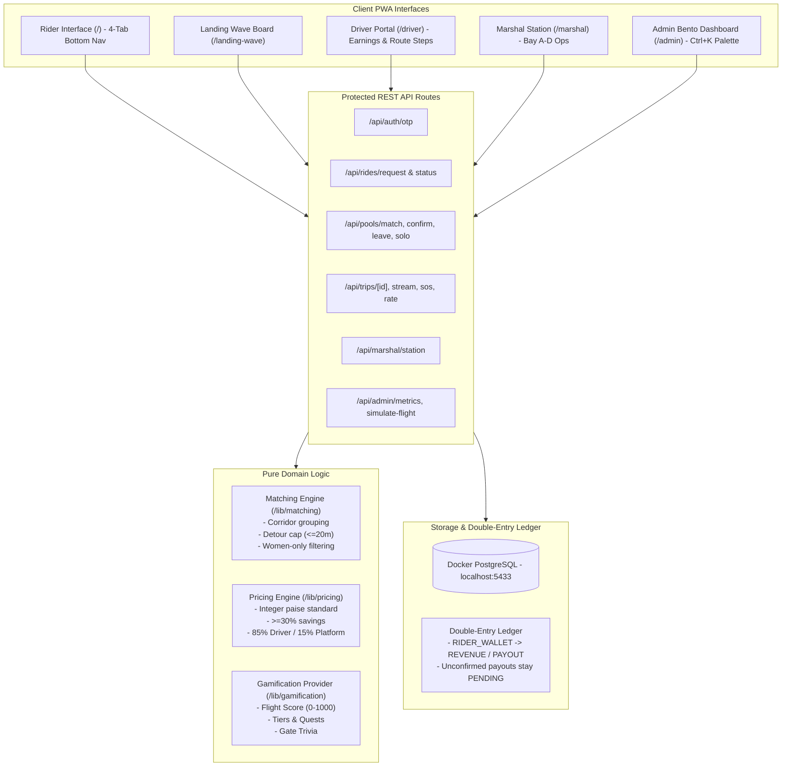

# ✈️ FlightPool (Night Runway)

> **Mobile-first PWA for Mumbai Airport (BOM) passengers to share cabs, split fares to destination corridors, and reduce airport congestion.**

[](https://github.com/Rohith00345/FlightPool)
[](https://github.com/Rohith00345/FlightPool)
[](https://github.com/Rohith00345/FlightPool)
[-black?logo=next.js)](https://nextjs.org/)
[](https://github.com/Rohith00345/FlightPool)

---

## 🌟 What's New in the Mega-Upgrade (Night Runway)

1. 🌌 **Night Runway Design System**:
   - Dark-first cockpit flight-deck ambiance with glowing amber (`#FFB020`), teal (`#2DE2C4`), and violet (`#7C6CFF`) tokens.
   - Built with Next.js managed typography (`Space Grotesk`, `Inter`, `JetBrains Mono`, `Noto Sans Devanagari`).
   - Three theme modes: **Night Runway** (Dark Default), **Daylight Terminal** (Light), and **AMOLED Black**.
   - Built-in tactile haptics (`navigator.vibrate`) and reduced-motion support.
2. 🛬 **Landing Wave Arrivals Board (`/landing-wave`)**:
   - Split-flap arrivals schedule showing incoming flights to BOM Terminal 1 & 2 with active pooling corridors.
3. 🎮 **FlightDeck Gamification Layer (`/` Rewards Tab)**:
   - Flight Score (0–1000) across 5 weighted categories (Reliability 30%, Community 25%, Safety 20%, Loyalty 15%, Profile 10%).
   - Tiers (Taxi, Takeoff, Cruise, Jet Stream, Supersonic) and Ranks (Ground Crew to Ace).
   - Miles store, season quests with streak freeze, passport stamps, and opt-in Green Miles leaderboard.
   - Fail-closed demo gating: Active mock gamification in demo mode; tasteful "Rewards coming soon" in production.
4. 🛡️ **Enterprise Security & DPDP Compliance**:
   - Strict RBAC across all 28 API routes (`docs/ROUTE_ACCESS_TABLE.md`).
   - Constant-time HMAC signatures for webhooks and session tokens.
   - Bounded wait-cap evaluation with explicit user consent before solo conversion.
   - Strict integer paise money standard (`docs/MONEY_UNITS.md`).
5. 📊 **Admin Bento Fleet Dashboard (`/admin`)**:
   - 6 essential fleet KPIs including wait time formula (`confirmedAt - readyAt`) and fill rate with/without solo.
   - Command Palette (`Ctrl+K` / `Cmd+K`) for rapid airport operations control.

---

## 🏛️ System Architecture



---

## 🚀 Local Development Quickstart

### Prerequisites
- Node.js 20 LTS
- Local Docker running PostgreSQL on `localhost:5433` (`flightpool-postgres`)

### 1. Verification & Preflight
```bash
npm run check       # Runs preflight environment & database safety check
npm run verify      # Runs complete TypeScript, ESLint, and Vitest test suites
```

### 2. Run Test Suites
```bash
npm test            # Runs 66 unit & integration tests
npx playwright test # Runs complete e2e browser test suite
```

### 3. Run Development Server
```bash
npm run dev         # Starts Next.js with Turbopack on http://localhost:3000
```
