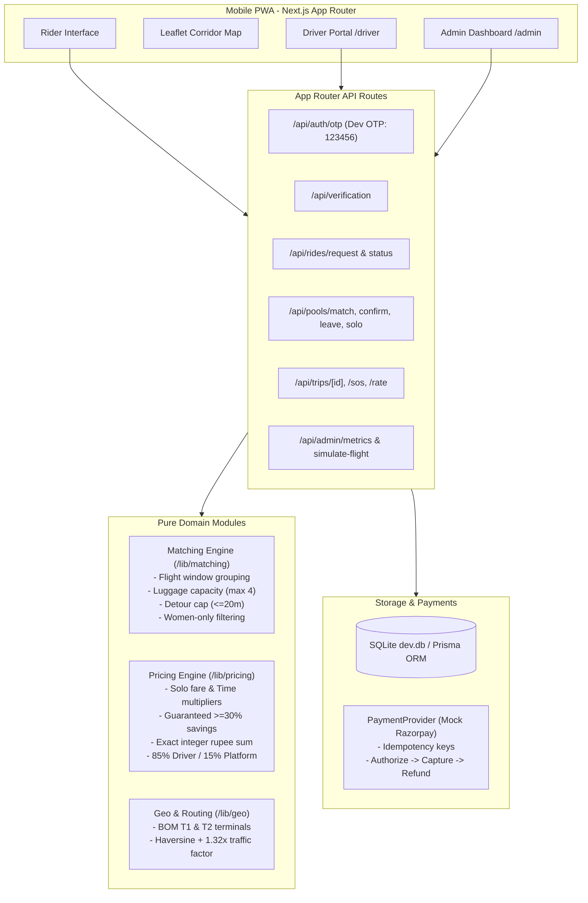

# ✈️ FlightPool (फ़्लाइटपूल)

> **Mobile-first PWA for Mumbai Airport (BOM) passengers to share cabs and split fares to nearby destination corridors.**

---

## 🌟 Key Features

- 📱 **Mobile-First PWA UX**: Designed with 48px tap targets, one primary action per screen, works seamlessly down to 360px viewport width, and features dual **English & Hindi (हिंदी)** labels.
- 🛫 **Flight & Boarding Pass Verification**: Mock scanning and verification tied to real flight arrival schedules at **Mumbai Airport (BOM Terminal 1 & 2)**.
- 🗺️ **Interactive Leaflet Map**: Visualizes Mumbai Airport terminals and destination corridors (Thane, Mulund, Powai, Bandra, Andheri, Navi Mumbai) with route polylines and drop-off markers.
- 🧮 **Pure Matching Engine (`/lib/matching`)**: Matches riders within a 30-minute flight window, enforces max 4 riders per cab, luggage capacity (max 4 bags), max detour cap (≤ 20 min), and women-only pools.
- 💰 **Fair Pricing Engine (`/lib/pricing`)**: Solo fare based on base + distance + time-of-day multipliers. Pool fare provides guaranteed **minimum 30% savings** (up to 52%), exact integer rupee rounding, and transparent driver payout (85%) / platform commission (15%).
- 🛡️ **Safety & Trust**:
  - **Women-only pool option**: Strictly matches verified female travelers together.
  - **Privacy**: Masks exact street addresses until pool confirmation.
  - **Penalty-Free Cancellation**: Leave a forming pool anytime before driver dispatch.
  - **Emergency SOS**: Alerts Mumbai Airport Security & Mumbai Police (112) with instant emergency dialer.
  - **Live Trip Sharing**: Shareable tracking links for friends and family.
- 💳 **Mock Razorpay Flow**: Interface-driven payment lifecycle (Authorization on pool confirmation -> Capture on drop-off completion -> Instant refund on pool collapse).
- 📊 **Admin Operations Dashboard (`/admin`)**: Real-time KPI metrics (Match rate, Fill rate, Avg wait, Avg detour, Revenue) and an interactive **"Land a Flight"** simulation panel.
- 🚕 **Driver View (`/driver`)**: Ordered pickup/drop route sequence, OTP validation, and payout tracking.

---

## 🏛️ System Architecture



---

## 🚀 Quickstart & Setup

### Prerequisites
- Node.js 18+ (tested on Node v20 LTS)
- npm 9+

### 1. Clone & Install Dependencies
```bash
cd flightpool
npm install
```

### 2. Database Setup & Seeding
```bash
# Push Prisma schema to SQLite
npx prisma db push

# Seed 15 flights, 5 drivers/cabs, and 42 passengers across Mumbai zones
npx prisma db seed
```

### 3. Run Development Server
```bash
npm run dev
```
Open **[http://localhost:3000](http://localhost:3000)** in your mobile device simulator or browser (recommended viewport: 375px width).

---

## 🧪 Testing

### Vitest Unit Tests (Matching & Pricing Engines)
Runs 25 comprehensive unit tests covering all matching constraints, detour permutations, women-only filters, mid-pool cancellations, and pricing rounding integrity:
```bash
npm test
```

### Playwright E2E Tests
Runs automated browser tests covering the 4 main end-to-end user journeys:
1. 3 riders match and complete full trip lifecycle
2. Rider falls back to solo ride after wait cap
3. Rider cancels mid-pool penalty-free
4. Women-only pool strict segregation
5. 360px mobile viewport rendering & bilingual labels
```bash
npm run test:e2e
```

### Simulation CLI
Replay a flight landing from terminal CLI to observe pool formation, route detour, and fare distribution:
```bash
# Run simulation for Indigo 6E-204 from Delhi
npm run simulate 6E-204

# Run simulation for Air India AI-865 from Bengaluru
npm run simulate AI-865
```

---

## 🎬 Reviewer Demo Script (End-to-End Walkthrough)

1. **Rider Onboarding & Login**:
   - Open `http://localhost:3000`.
   - Click the **"Aarav Sharma"** quick-persona card (or enter any mobile number with OTP `123456`).
   - Click **CONTINUE • आगे बढ़ें**.

2. **Flight & Boarding Pass Verification**:
   - Select flight **6E-204 (DEL → BOM T2)**.
   - Click **CONFIRM FLIGHT 6E-204**.
   - Review the digital boarding pass card with PNR and seat number.
   - Click **VERIFY & CONTINUE • सत्यापित करें**.

3. **Destination & Upfront Fare**:
   - Tap on the **Thane** zone chip (or click on the interactive Mumbai corridor map).
   - Notice the upfront fare card: **₹360 instead of ₹740 • Save ₹380 (51%)**.
   - Choose luggage count (e.g. 1 bag).
   - Click **I'VE LANDED & READY • मैं तैयार हूँ**.

4. **Pool Formation & Mock Payment**:
   - View real-time pool formation with co-riders (e.g. Vikram Mehta, Rohan Kulkarni).
   - Notice other co-riders' exact addresses are masked to zone level for safety.
   - Click **CONFIRM & LOCK SHARE (₹360)**.
   - Select UPI (GPay/PhonePe) in the Razorpay sandbox modal and tap **AUTHORIZE ₹360**.

5. **Driver Assignment & Live Trip**:
   - Cab is assigned with driver details (Ramesh Shinde, ⭐ 4.9, Maruti Dzire `MH-02-EE-4123`).
   - Notice the 4-digit security OTP to share when boarding at Terminal 2.
   - Try the **Share Trip Link** button to copy or test the live tracking link.
   - Try the **Emergency SOS** button to view Mumbai Police (112) & Airport Security dispatch.

6. **Driver Progression & Trip Completion**:
   - In a new tab, navigate to `http://localhost:3000/driver`.
   - Click **En Route to Terminal Pickup** -> **All Passengers Boarded** -> **Complete All Drop-offs**.
   - Payment is automatically captured, and driver sees transparent 85% payout (₹680).

7. **Admin Dashboard & Flight Landing Simulator**:
   - Navigate to `http://localhost:3000/admin`.
   - View live KPI cards: **Match Rate (95%)**, **Fill Rate (2.4 riders/cab)**, **Avg Detour (+3.8m)**.
   - Under the simulation panel, select **AI-865** or **UK-993** and click **Land Flight & Match Pools**.
   - Watch newly formed pools appear instantly in the active pools table!

---

## 🐳 Production Docker & Cloud Deployment

FlightPool includes a production multi-stage [Dockerfile](file:///C:/Users/Rohith%20Nambaru/.gemini/antigravity-ide/scratch/flightpool/Dockerfile) based on Node 20 Alpine with Next.js standalone output and pre-seeded SQLite database.

### 1. Run with Docker Compose
```bash
# Build and run container in background
docker compose up --build -d

# Check running container
docker ps
```
The app will be live at `http://localhost:3000`.

### 2. Deploy to Render / Railway / Fly.io / Cloud Run
- **Render**: Connect your GitHub repository and select **Web Service (Docker)** or use the included [render.yaml](file:///C:/Users/Rohith%20Nambaru/.gemini/antigravity-ide/scratch/flightpool/render.yaml).
- **Railway**: Run `railway up` — Railway automatically detects the `Dockerfile` and deploys with persistent storage.
- **Fly.io**: Run `fly launch` and select the generated Dockerfile.
- **Google Cloud Run**: Run `gcloud run deploy flightpool --source . --port 3000 --allow-unauthenticated`.
