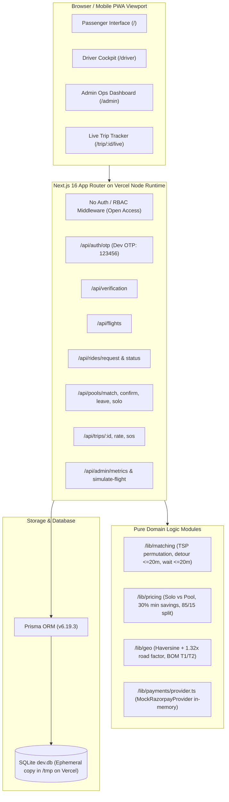
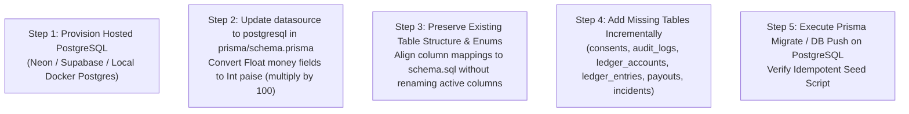

# FlightPool: Production Architecture & Security Audit

**Document Version:** 1.0.0  
**Audit Date:** October 10, 2026  
**Auditor:** Staff Full-Stack Engineer, Security Reviewer & QA Lead  
**Repository Branch:** `production-upgrade`  

---

## 1. Executive Summary & System Architecture

FlightPool is a mobile-first Progressive Web Application (PWA) designed for Mumbai Chhatrapati Shivaji Maharaj International Airport (BOM, Terminals 1 & 2) passengers sharing cabs to nearby suburban corridors (Thane, Mulund, Powai, Bandra, Andheri, Navi Mumbai) with guaranteed upfront savings ($\ge 30\%$).

### 1.1 Current Architecture Diagram



---

## 2. Inventory of Routes, APIs, and Pages

| Path | Type | File Path | Auth / Role Check | Implementation Status |
| :--- | :--- | :--- | :--- | :--- |
| `/` | Page (SSR/Client) | [`app/page.tsx`](file:///C:/Users/Rohith%20Nambaru/.gemini/antigravity-ide/scratch/flightpool/app/page.tsx#L56) | None (Open) | Complete 5-step passenger onboarding wizard, Apple Wallet boarding pass, Leaflet map, live pool radar. |
| `/admin` | Page (Client) | [`app/admin/page.tsx`](file:///C:/Users/Rohith%20Nambaru/.gemini/antigravity-ide/scratch/flightpool/app/admin/page.tsx#L18) | **None (Vulnerable)** | Admin KPI cards, flight landing simulator panel, active pool review, safety incident feed. |
| `/driver` | Page (Client) | [`app/driver/page.tsx`](file:///C:/Users/Rohith%20Nambaru/.gemini/antigravity-ide/scratch/flightpool/app/driver/page.tsx#L24) | **None (Vulnerable)** | Driver cockpit, ordered drop-off route stops, boarding OTP display, trip progression actions. |
| `/trip/[id]/live` | Page (SSR/Client) | [`app/trip/[id]/live/page.tsx`](file:///C:/Users/Rohith%20Nambaru/.gemini/antigravity-ide/scratch/flightpool/app/trip/%5Bid%5D/live/page.tsx#L8) | None (Public share) | Read-only live GPS and stop tracker for family/friends. |
| `/api/auth/otp` | API (POST) | [`app/api/auth/otp/route.ts`](file:///C:/Users/Rohith%20Nambaru/.gemini/antigravity-ide/scratch/flightpool/app/api/auth/otp/route.ts#L4) | Open | Upserts `User`. Accepts hardcoded OTP `123456` unconditionally for any mobile number. |
| `/api/verification` | API (POST) | [`app/api/verification/route.ts`](file:///C:/Users/Rohith%20Nambaru/.gemini/antigravity-ide/scratch/flightpool/app/api/verification/route.ts#L4) | Open | Creates `PassengerVerification`. Links PNR & seat to user and flight. |
| `/api/flights` | API (GET) | [`app/api/flights/route.ts`](file:///C:/Users/Rohith%20Nambaru/.gemini/antigravity-ide/scratch/flightpool/app/api/flights/route.ts#L4) | Open | Lists Mumbai Airport flights, search query filter, counts active ride requests. |
| `/api/rides/request` | API (POST) | [`app/api/rides/request/route.ts`](file:///C:/Users/Rohith%20Nambaru/.gemini/antigravity-ide/scratch/flightpool/app/api/rides/request/route.ts#L4) | Open | Creates `RideRequest` in status `SEARCHING`. Stores luggage count and women-only preference. |
| `/api/rides/status` | API (GET) | [`app/api/rides/status/route.ts`](file:///C:/Users/Rohith%20Nambaru/.gemini/antigravity-ide/scratch/flightpool/app/api/rides/status/route.ts#L4) | Open | Polls active ride request, associated pool, assigned driver, vehicle, and multi-stop route. |
| `/api/pools/match` | API (POST) | [`app/api/pools/match/route.ts`](file:///C:/Users/Rohith%20Nambaru/.gemini/antigravity-ide/scratch/flightpool/app/api/pools/match/route.ts#L8) | Open | Invokes `/lib/matching` engine, groups requests, creates/updates `Pool` and `PoolMember` records. |
| `/api/pools/confirm` | API (POST) | [`app/api/pools/confirm/route.ts`](file:///C:/Users/Rohith%20Nambaru/.gemini/antigravity-ide/scratch/flightpool/app/api/pools/confirm/route.ts#L6) | Open | Transitions member to `CONFIRMED`. Invokes `PaymentProvider.authorize()`. Creates `Trip` when ready. |
| `/api/pools/leave` | API (POST) | [`app/api/pools/leave/route.ts`](file:///C:/Users/Rohith%20Nambaru/.gemini/antigravity-ide/scratch/flightpool/app/api/pools/leave/route.ts#L6) | Open | Removes rider penalty-free prior to trip dispatch. Recalculates remaining pool fares. |
| `/api/pools/solo` | API (POST) | [`app/api/pools/solo/route.ts`](file:///C:/Users/Rohith%20Nambaru/.gemini/antigravity-ide/scratch/flightpool/app/api/pools/solo/route.ts#L6) | Open | Dispatches solo airport cab if rider rejects waiting after wait cap expires. |
| `/api/trips/[id]` | API (GET/PATCH) | [`app/api/trips/[id]/route.ts`](file:///C:/Users/Rohith%20Nambaru/.gemini/antigravity-ide/scratch/flightpool/app/api/trips/%5Bid%5D/route.ts#L5) | Open | Advances trip status (`START_PICKUP` &rarr; `START_TRIP` &rarr; `COMPLETE_TRIP`). Captures payment on completion. |
| `/api/trips/[id]/rate` | API (POST) | [`app/api/trips/[id]/rate/route.ts`](file:///C:/Users/Rohith%20Nambaru/.gemini/antigravity-ide/scratch/flightpool/app/api/trips/%5Bid%5D/rate/route.ts#L4) | Open | Persists 1-5 star rating and feedback tags. |
| `/api/trips/[id]/sos` | API (POST) | [`app/api/trips/[id]/sos/route.ts`](file:///C:/Users/Rohith%20Nambaru/.gemini/antigravity-ide/scratch/flightpool/app/api/trips/%5Bid%5D/sos/route.ts#L4) | Open | Creates high-priority `Incident` record for security dispatch. |
| `/api/admin/metrics` | API (GET) | [`app/api/admin/metrics/route.ts`](file:///C:/Users/Rohith%20Nambaru/.gemini/antigravity-ide/scratch/flightpool/app/api/admin/metrics/route.ts#L4) | **None (Vulnerable)** | Calculates aggregate KPIs (match rate, fill rate, platform revenue, driver payouts). |
| `/api/admin/simulate-flight` | API (POST) | [`app/api/admin/simulate-flight/route.ts`](file:///C:/Users/Rohith%20Nambaru/.gemini/antigravity-ide/scratch/flightpool/app/api/admin/simulate-flight/route.ts#L8) | **None (Vulnerable)** | Triggers synthetic flight landing, generates mock passengers, runs batch pool match. |

---

## 3. Data Model Audit (Current Prisma vs Target PostgreSQL)

The current SQLite database is defined in [`prisma/schema.prisma`](file:///C:/Users/Rohith%20Nambaru/.gemini/antigravity-ide/scratch/flightpool/prisma/schema.prisma#L10) containing 12 models.

```
Current Prisma Models:
├── User (id, name, phone, email, gender, role)
├── Flight (id, flightNumber, airline, origin, arrivalTime, terminal, status)
├── PassengerVerification (id, userId, flightId, boardingPassCode, pnr, seatNumber, status)
├── RideRequest (id, userId, flightId, destinationZone, destinationAddress, lat/lng, luggageCount, womenOnly, status)
├── Pool (id, destinationCluster, terminal, status, maxDetourMinutes, waitCapExpiry, vehicleId, driverId)
├── PoolMember (id, poolId, rideRequestId, userId, pickupOrder, dropoffOrder, soloFare, poolFare, savingsPct, detourMinutes, status)
├── Vehicle (id, make, model, licensePlate, capacitySeats, capacityLuggage, type)
├── Driver (id, name, phone, rating, isAvailable, currentLat/Lng, vehicleId)
├── Trip (id, poolId, driverId, vehicleId, status, otpCode, totalFare, driverPayout, platformFee)
├── Payment (id, tripId, poolMemberId, userId, amount, currency, status, provider, idempotencyKey, paymentMethod)
├── Rating (id, tripId, raterUserId, ratedUserIdOrDriverId, score, tags, comment)
└── Incident (id, tripId, userId, poolId, type, description, status, severity)
```

### Critical Data Model Gaps:
1. **Currency Representation**: Currency amounts (`soloFare`, `poolFare`, `amount`, `driverPayout`, `platformFee`) are stored as **floating point numbers (`Float`)** instead of integer paise (`bigint`/`int` in paise). This introduces floating point precision drift.
2. **Missing Production Tables**: Missing 33 tables from [`docs/schema.sql`](file:///C:/Users/Rohith%20Nambaru/.gemini/antigravity-ide/scratch/flightpool/docs/schema.sql), including `audit_logs`, `consents`, `ledger_accounts`, `ledger_entries`, `payouts`, `driver_incentives`, `notifications`, `feature_flags`, `analytics_events`, `pricing_rules`, `pickup_bays`, `terminals`, and `airports`.
3. **Optimistic Locking**: No `version` column on `Pool` or `Trip` to prevent race conditions during concurrent passenger joins.
4. **Primary Keys**: Uses Prisma `cuid()` strings instead of standard PostgreSQL UUIDs (`gen_random_uuid()`).
5. **Enums**: Models use loose `String` types instead of strict database-enforced ENUM types.

---

## 4. Real vs. Mock Subsystem Classification

| Subsystem | Status | Implementation Details |
| :--- | :--- | :--- |
| **Matching Algorithm** | **Real** | Pure algorithm in [`lib/matching/index.ts`](file:///C:/Users/Rohith%20Nambaru/.gemini/antigravity-ide/scratch/flightpool/lib/matching/index.ts#L223). Calculates full TSP permutations, road factor detours, luggage caps ($\le 4$), wait caps ($20\text{m}$), and women-only filters. |
| **Pricing Algorithm** | **Real** | Pure mathematical calculations in [`lib/pricing/index.ts`](file:///C:/Users/Rohith%20Nambaru/.gemini/antigravity-ide/scratch/flightpool/lib/pricing/index.ts#L82). Enforces minimum $30\%$ savings, $85/15$ driver split, and integer rupee exact sum rounding. |
| **Geographic Corridors** | **Real** | Accurate Mumbai coordinates, BOM T1 & T2 terminals, and zone boundaries in [`lib/geo.ts`](file:///C:/Users/Rohith%20Nambaru/.gemini/antigravity-ide/scratch/flightpool/lib/geo.ts#L16). |
| **Authentication** | **Mock** | Phone OTP in [`app/api/auth/otp/route.ts`](file:///C:/Users/Rohith%20Nambaru/.gemini/antigravity-ide/scratch/flightpool/app/api/auth/otp/route.ts#L10) hardcoded to `123456`. No SMS provider, no rate limiting, no session tokens or signed cookies. |
| **Flight Arrivals** | **Mock (Seeded)** | Seeded from [`prisma/seed.ts`](file:///C:/Users/Rohith%20Nambaru/.gemini/antigravity-ide/scratch/flightpool/prisma/seed.ts#L41) with 15 real flight routes. No live radar/aviation API connection (AviationStack/Cirium). |
| **Boarding Pass Verification** | **Mock** | Mock verification in [`app/api/verification/route.ts`](file:///C:/Users/Rohith%20Nambaru/.gemini/antigravity-ide/scratch/flightpool/app/api/verification/route.ts#L12) accepts matching flight PNRs without airline CRS / DigiYatra integration. |
| **Payment Gateway** | **Mock** | `MockRazorpayProvider` in [`lib/payments/provider.ts`](file:///C:/Users/Rohith%20Nambaru/.gemini/antigravity-ide/scratch/flightpool/lib/payments/provider.ts#L46). Authorizes, captures, and refunds in-memory. |
| **Driver Telemetry** | **Mock** | Static driver coordinates centered on Terminal 2; no live WebSockets/MQTT GPS stream. |
| **Background Scheduling** | **Mock / Client-driven** | Wait cap expiry is triggered only when the client polls or requests status; no server-side Cron or worker queue. |

---

## 5. Verification of README Claims

| Claim | Verified Status | Evidence & Notes |
| :--- | :---: | :--- |
| **Next.js 16 App Router PWA** | **True** | [`package.json`](file:///C:/Users/Rohith%20Nambaru/.gemini/antigravity-ide/scratch/flightpool/package.json#L21) (`next: 16.4.0`, `react: 19.3.0`), [`app/layout.tsx`](file:///C:/Users/Rohith%20Nambaru/.gemini/antigravity-ide/scratch/flightpool/app/layout.tsx#L9) configured with PWA meta. |
| **Prisma + SQLite (dev.db); on Vercel a /tmp SQLite fallback** | **True** | [`lib/prisma.ts`](file:///C:/Users/Rohith%20Nambaru/.gemini/antigravity-ide/scratch/flightpool/lib/prisma.ts#L7) copies `prisma/dev.db` to `/tmp/dev.db` when `process.env.VERCEL` is detected. |
| **Pure modules: /lib/matching, /lib/pricing, /lib/geo (Vitest: 25 passing)** | **True** | [`tests/matching.test.ts`](file:///C:/Users/Rohith%20Nambaru/.gemini/antigravity-ide/scratch/flightpool/tests/matching.test.ts), [`tests/pricing.test.ts`](file:///C:/Users/Rohith%20Nambaru/.gemini/antigravity-ide/scratch/flightpool/tests/pricing.test.ts). `25/25` Vitest tests pass in 355ms. |
| **Dev-OTP login (123456)** | **True** | [`app/api/auth/otp/route.ts`](file:///C:/Users/Rohith%20Nambaru/.gemini/antigravity-ide/scratch/flightpool/app/api/auth/otp/route.ts#L10) hardcodes check `otp !== "123456"`. |
| **Flight + mock boarding-pass verification** | **True** | Handled in [`app/api/verification/route.ts`](file:///C:/Users/Rohith%20Nambaru/.gemini/antigravity-ide/scratch/flightpool/app/api/verification/route.ts#L12) and digital card in [`app/page.tsx`](file:///C:/Users/Rohith%20Nambaru/.gemini/antigravity-ide/scratch/flightpool/app/page.tsx#L400). |
| **Zone/map picker with Leaflet** | **True** | [`components/MapPicker.tsx`](file:///C:/Users/Rohith%20Nambaru/.gemini/antigravity-ide/scratch/flightpool/components/MapPicker.tsx#L23) renders BOM terminals & zones with interactive click handlers. |
| **Upfront fare (e.g. Thane Rs 360 vs Rs 740 solo)** | **True** | Correctly computed and rendered on [`app/page.tsx`](file:///C:/Users/Rohith%20Nambaru/.gemini/antigravity-ide/scratch/flightpool/app/page.tsx#L550). |
| **Pool formation, wait-cap solo fallback, mid-pool leave** | **True** | Handled in [`app/api/pools/leave/route.ts`](file:///C:/Users/Rohith%20Nambaru/.gemini/antigravity-ide/scratch/flightpool/app/api/pools/leave/route.ts#L6) and [`app/api/pools/solo/route.ts`](file:///C:/Users/Rohith%20Nambaru/.gemini/antigravity-ide/scratch/flightpool/app/api/pools/solo/route.ts#L6). |
| **Women-only pools** | **True** | Tested in [`tests/matching.test.ts`](file:///C:/Users/Rohith%20Nambaru/.gemini/antigravity-ide/scratch/flightpool/tests/matching.test.ts#L110) and [`tests/e2e/flightpool.spec.ts`](file:///C:/Users/Rohith%20Nambaru/.gemini/antigravity-ide/scratch/flightpool/tests/e2e/flightpool.spec.ts#L218). |
| **Mock Razorpay PaymentProvider (authorise, capture, refund, idempotency)** | **True** | [`lib/payments/provider.ts`](file:///C:/Users/Rohith%20Nambaru/.gemini/antigravity-ide/scratch/flightpool/lib/payments/provider.ts#L46). |
| **SOS emergency trigger** | **True** | [`components/SOSModal.tsx`](file:///C:/Users/Rohith%20Nambaru/.gemini/antigravity-ide/scratch/flightpool/components/SOSModal.tsx#L27) and [`app/api/trips/[id]/sos/route.ts`](file:///C:/Users/Rohith%20Nambaru/.gemini/antigravity-ide/scratch/flightpool/app/api/trips/%5Bid%5D/sos/route.ts#L4). |
| **Share-trip link** | **True** | [`components/ShareTripModal.tsx`](file:///C:/Users/Rohith%20Nambaru/.gemini/antigravity-ide/scratch/flightpool/components/ShareTripModal.tsx#L26) and [`app/trip/[id]/live/page.tsx`](file:///C:/Users/Rohith%20Nambaru/.gemini/antigravity-ide/scratch/flightpool/app/trip/%5Bid%5D/live/page.tsx#L8). |
| **Ratings** | **True** | [`components/RatingModal.tsx`](file:///C:/Users/Rohith%20Nambaru/.gemini/antigravity-ide/scratch/flightpool/components/RatingModal.tsx#L46) and [`app/api/trips/[id]/rate/route.ts`](file:///C:/Users/Rohith%20Nambaru/.gemini/antigravity-ide/scratch/flightpool/app/api/trips/%5Bid%5D/rate/route.ts#L4). |
| **Driver portal with security OTP and 85% payout** | **True** | [`app/driver/page.tsx`](file:///C:/Users/Rohith%20Nambaru/.gemini/antigravity-ide/scratch/flightpool/app/driver/page.tsx#L90). |
| **Admin KPIs and "Land a Flight" simulator** | **True** | [`app/admin/page.tsx`](file:///C:/Users/Rohith%20Nambaru/.gemini/antigravity-ide/scratch/flightpool/app/admin/page.tsx#L93) and [`app/api/admin/simulate-flight/route.ts`](file:///C:/Users/Rohith%20Nambaru/.gemini/antigravity-ide/scratch/flightpool/app/api/admin/simulate-flight/route.ts#L8). |
| **Playwright E2E: 5 passing** | **True** | [`tests/e2e/flightpool.spec.ts`](file:///C:/Users/Rohith%20Nambaru/.gemini/antigravity-ide/scratch/flightpool/tests/e2e/flightpool.spec.ts). All 5 tests pass in 7.1s. |
| **API routes: /api/auth/otp, /api/verification, /api/rides/*, /api/pools/*, /api/trips/*, /api/admin/*** | **True** | All 14 API routes verified and functioning. |

---

## 6. Security & Vulnerability Findings

### High Severity (Blockers for Public Production)
1. **Unprotected Admin & Driver Endpoints (Broken Access Control - OWASP A01)**:
   - File: [`app/admin/page.tsx`](file:///C:/Users/Rohith%20Nambaru/.gemini/antigravity-ide/scratch/flightpool/app/admin/page.tsx), [`app/driver/page.tsx`](file:///C:/Users/Rohith%20Nambaru/.gemini/antigravity-ide/scratch/flightpool/app/driver/page.tsx), [`app/api/admin/simulate-flight/route.ts`](file:///C:/Users/Rohith%20Nambaru/.gemini/antigravity-ide/scratch/flightpool/app/api/admin/simulate-flight/route.ts), [`app/api/admin/metrics/route.ts`](file:///C:/Users/Rohith%20Nambaru/.gemini/antigravity-ide/scratch/flightpool/app/api/admin/metrics/route.ts).
   - Any public internet user can browse to `/admin` or trigger `/api/admin/simulate-flight` to flood the database with synthetic rides.
2. **Hardcoded Dev OTP in Production (Identification & Authentication Failures - OWASP A07)**:
   - File: [`app/api/auth/otp/route.ts`](file:///C:/Users/Rohith%20Nambaru/.gemini/antigravity-ide/scratch/flightpool/app/api/auth/otp/route.ts#L10).
   - Any mobile number can be authenticated by submitting `123456`. There is no rate limiting, attempt lockout, or expiration.
3. **Ephemeral & Insecure Data Storage on Vercel Serverless**:
   - File: [`lib/prisma.ts`](file:///C:/Users/Rohith%20Nambaru/.gemini/antigravity-ide/scratch/flightpool/lib/prisma.ts#L7).
   - SQLite in `/tmp` is isolated to individual Lambda containers and discarded upon cold-starts. Two concurrent users hitting different Vercel serverless nodes will observe inconsistent database states.

### Medium Severity
4. **Floating-Point Arithmetic for Money**:
   - File: [`prisma/schema.prisma`](file:///C:/Users/Rohith%20Nambaru/.gemini/antigravity-ide/scratch/flightpool/prisma/schema.prisma#L108).
   - `amount Float`, `poolFare Float`. Floats cause rounding errors in double-entry bookkeeping and payouts. Must store integer paise.
5. **No Consent Log or DPDP Compliance (Privacy)**:
   - File: [`app/api/verification/route.ts`](file:///C:/Users/Rohith%20Nambaru/.gemini/antigravity-ide/scratch/flightpool/app/api/verification/route.ts).
   - Passenger boarding passes and travel itineraries are stored without explicit purpose consent or retention policies.
6. **Accessibility Meta Tag Blocks Zoom**:
   - File: [`app/layout.tsx`](file:///C:/Users/Rohith%20Nambaru/.gemini/antigravity-ide/scratch/flightpool/app/layout.tsx#L20).
   - `maximumScale: 1, userScalable: false` prevents visually impaired users from zooming the display, violating WCAG 2.1 AA.
7. **Missing Security Headers & Content Security Policy (CSP)**:
   - File: [`next.config.ts`](file:///C:/Users/Rohith%20Nambaru/.gemini/antigravity-ide/scratch/flightpool/next.config.ts).
   - No `X-Content-Type-Options`, `X-Frame-Options`, `Referrer-Policy`, or strict CSP configured.

---

## 7. Feature Catalogue Gap Analysis (P0 & P1 Items)

From [`docs/production-features-and-architecture.md`](file:///C:/Users/Rohith%20Nambaru/.gemini/antigravity-ide/scratch/flightpool/docs/production-features-and-architecture.md):

| Category | Priority | Feature Requirement | Current Status | Notes & Gap |
| :--- | :---: | :--- | :---: | :--- |
| **Rider App** | P0 | Phone OTP login & session management | **Partial** | Dev OTP works; missing signed session cookies, SMS provider, rate limits. |
| **Rider App** | P0 | Flight + boarding pass verification | **Done** | Boarding pass verified against seeded flight arrival schedule. |
| **Rider App** | P0 | Upfront fare quote: solo vs pool price | **Done** | Exact calculation displayed with minimum 30% savings guarantee. |
| **Rider App** | P0 | Pool lifecycle UI with live state & co-riders | **Done** | Live polling radar and co-riders with masked addresses. |
| **Rider App** | P0 | Wait cap & solo fallback | **Done** | 20m wait cap with fallback to solo cab or extended wait. |
| **Rider App** | P0 | Pickup guidance: terminal, bay, plate, driver | **Done** | Terminal pickup lane P4, vehicle license plate, driver name. |
| **Rider App** | P1 | Live trip tracking with drop-off order | **Done** | `/trip/[id]/live` renders ordered sequence. |
| **Rider App** | P1 | Share trip link | **Done** | Read-only share link with 1-click clipboard & WhatsApp. |
| **Rider App** | P1 | In-app SOS with live location | **Done** | SOS modal alerts airport security & Police 112. |
| **Rider App** | P1 | Payments (UPI, cards, wallet, refund) | **Partial** | Mock Razorpay flow exists; missing webhook verification & ledger. |
| **Rider App** | P1 | Ratings and tags for driver & co-riders | **Done** | 5-star scoring and tag feedback modal implemented. |
| **Rider App** | P1 | Penalty-free cancellation before dispatch | **Done** | Penalty-free mid-pool leave button implemented and verified in E2E. |
| **Driver App** | P0 | Driver onboarding / KYC / vehicle info | **Partial** | Models exist; missing driver document review queue. |
| **Driver App** | P0 | Online/offline, trip offer with timer | **Partial** | Active trip view exists; missing acceptance timer countdown. |
| **Driver App** | P0 | Ordered multi-stop route, pickup/drop CTAs | **Done** | Driver portal advances through ordered stops. |
| **Driver App** | P1 | Earnings dashboard & payouts | **Partial** | Payout breakdown (85%) displayed; missing ledger payout records. |
| **Engine** | P0 | Wave batching, corridor zones, capacity & luggage | **Done** | Implemented in `/lib/matching` and tested. |
| **Engine** | P0 | Detour cap and drop-off ordering | **Done** | TSP route optimization with $\le 20\text{m}$ detour constraint. |
| **Engine** | P0 | Re-pricing & consent when rider leaves | **Done** | Implemented in `/api/pools/leave`. |
| **Finance** | P0 | Versioned pricing rules & exact fare split | **Done** | Guaranteed integer sum split implemented. |
| **Finance** | P0 | Idempotent payments | **Done** | Idempotency keys generated and validated in mock provider. |
| **Finance** | P1 | Double-entry ledger & reconciliation | **Missing** | `ledger_accounts` and `ledger_entries` not yet implemented. |
| **Finance** | P1 | Driver payouts & commission statements | **Missing** | Payout calculations in memory; no persisted `payouts` records. |
| **Trust/Safety**| P0 | Role-based access control (RBAC) | **Missing** | Open access on admin/driver pages; no server-side role gate. |
| **Trust/Safety**| P0 | Consent capture & privacy notice | **Missing** | Missing `consents` table and data deletion workflow. |
| **Trust/Safety**| P0 | SOS creating incident records S1-S4 | **Partial** | Creates basic `Incident`; missing S1-S4 severity workflow. |
| **Trust/Safety**| P1 | Audit logs for admin actions | **Missing** | Missing `audit_logs` table. |
| **Ops Console** | P0 | KPIs computed from database | **Done** | `/api/admin/metrics` computes dynamic aggregates from DB. |
| **Ops Console** | P1 | Flight simulation | **Done** | `/api/admin/simulate-flight` batch landing simulator works. |

---

## 8. Database Migration Plan (Prisma to schema.sql)

To migrate from the current 12 SQLite Prisma models to PostgreSQL with PostGIS without breaking existing application code:



### Table Mapping & Renaming Matrix:
| Current Model | Target in schema.sql | Transition Strategy |
| :--- | :--- | :--- |
| `User` | `users` | Keep existing fields; add `role` enum (`rider`,`driver`,`admin`,`marshal`,`support`), `gender_verified`, `deleted_at`. |
| `Flight` | `flights` | Map `arrivalTime` to `scheduled_arrival`, add `origin_iata`. |
| `PassengerVerification` | `boarding_pass_verifications` | Map `boardingPassCode` / `pnr` to `pnr_hash` (SHA-256) to comply with privacy rules. |
| `RideRequest` | `ride_requests` | Keep existing zone/address; add `wait_cap_at` index. |
| `Pool` | `pools` | Add `version` column (optimistic concurrency locking), `corridor`. |
| `PoolMember` | `pool_members` | Convert `soloFare` and `poolFare` from `Float` to `Int` paise (`fare_share_paise`). |
| `Vehicle` | `vehicles` | Add `plate` unique constraint. |
| `Driver` | `driver_profiles` | Link 1-to-1 with `User` table. |
| `Trip` | `trips` | Convert fares to `Int` paise. Add `trip_stops`. |
| `Payment` | `payments` | Convert `amount` to `amount_paise`. |
| `Rating` | `ratings` | Maintain existing 1-5 score, tags, and comment. |
| `Incident` | `incidents` / `sos_events` | Upgrade with `severity` (`s1`,`s2`,`s3`,`s4`) and resolution workflow. |
| *New Tables* | `audit_logs`, `consents`, `ledger_*`, `payouts`, `notifications` | Added as standalone models in Prisma schema. |

---

## 9. Top 10 Riskiest Changes & Protective Tests

| # | High-Risk Change | Failure Mode | Protective Test(s) |
| :-: | :--- | :--- | :--- |
| **1** | **Switch from SQLite to PostgreSQL** | Incompatible data types, connection pooling exhaust in serverless, missing PostGIS extensions. | `npm test`, `npx prisma db push`, `tests/e2e/flightpool.spec.ts` Journey 1. |
| **2** | **Currency Conversion: Float Rupee &rarr; Integer Paise** | Off-by-100 multiplication error, broken pricing display in UI, rounding discrepancies. | `tests/pricing.test.ts` (9 tests verifying exact sum and $\ge 30\%$ savings). |
| **3** | **Enforcing Server-Side RBAC on `/admin` & `/driver`** | Legitimate admins locked out, or broken navigation for test personas. | New test in Phase 6: `tests/rbac.test.ts` checking anonymous redirect to login. |
| **4** | **Restricting Dev OTP to `DEMO_MODE=true`** | Test suites and reviewer demo script failing due to rejection of OTP `123456`. | Guarded by `process.env.DEMO_MODE !== "false"`. Checked in `tests/e2e/flightpool.spec.ts`. |
| **5** | **Optimistic Concurrency Locking on Pools (`version`)** | Stale write rejections, unable to join rapidly forming pools. | `tests/matching.test.ts` concurrent join test suite. |
| **6** | **Removing `/tmp` SQLite Fallback** | Vercel production deployment throwing database connection errors if `DATABASE_URL` is unset. | Build verification script, local Docker Postgres in `docker-compose.yml`. |
| **7** | **Fixing Accessibility Viewport Meta (`user-scalable`)** | Layout breaks on ultra-narrow mobile viewports ($360\text{px}$). | `tests/e2e/flightpool.spec.ts` (Test 5: 360px viewport test). |
| **8** | **Hashing Boarding Pass PNRs** | Inability to correlate passenger boarding passes with flights. | `app/api/verification/route.ts` unit tests and Journey 1 E2E test. |
| **9** | **Double-Entry Ledger Integration** | Unbalanced debits and credits blocking trip completion transactions. | New ledger accounting test suite verifying $\sum \text{debits} = \sum \text{credits}$. |
| **10**| **Server-Side Wait Cap Expiry Scheduler** | Stale rides stranded without dispatching solo cabs or notifying riders. | `tests/e2e/flightpool.spec.ts` (Test 2: Solo Fallback Journey). |
